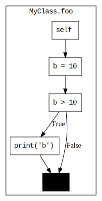

# Control Flow Graphs

This page describes an additional PythonTA feature: visualizing the control flow of a program.
This feature makes it easier to visualize how the computer executes your program by producing a scalable control flow graph using [Graphviz].

## Code Example

```python
x = 0
if x > 0:
    x = 4
else:
    x = -1
```

The corresponding control flow graph for the code example above is included below:


## Additional installation required!

To use PythonTA's control flow graph visualizer, you'll need to install some additional software:

1. Install [Graphviz](https://www.graphviz.org/download/). (This isn't Python software.)
2. Install some additional Python libaries.
   Run the following command in the terminal:

   ```console
   $ python3 -m pip install python-ta[cfg]
   ```

## Sample Usage

This feature uses `python_ta.cfg.cfg_generator.generate_cfg` to produce these control flow graphs.

The first argument specifies which Python file to create a control flow graph for. By default, it generates a control flow graph of the current file in which it is called from.

```python
# my_file.py

... # code here

if __name__ == "__main__":
    import python_ta.cfg.cfg_generator as cfg_generator

    cfg_generator.generate_cfg()
```

After running this file, a new svg file is created called `my_file.svg`.

This feature is not limited to just the Python file from which the function is called. It can also be used to generate a control flow graph of a different Python file. The set-up is the exact same as before, except we can pass an argument to the function call which is the path to the target Python file.

```python
import python_ta.cfg.cfg_generator as cfg_generator

cfg_generator.generate_cfg("my_file.py")
```

There is also an additional optional argument that allows you to configure how the control flow graphs are generated. For example, you can separate the `if` condition from the preceding statements, or you can specify function and method names to restrict the creation of control flow graphs to just those functions.

```python
# Assume my_file.py has a class `MyClass` with method `MyClass.foo` and a top-level method `foo`

import python_ta.cfg.cfg_generator as cfg_generator

options = {
        "separate-condition-blocks": True,
        "functions": ["MyClass.foo"]
    }

cfg_generator.generate_cfg(mod="my_file.py", visitor_options=options)
```

which produces the following control flow graph:



**Note:** only one control flow graph can be generated per function call (i.e. you can't pass in a list of files to generate control flow graphs for).

## API

```{eval-rst}
.. autofunction:: python_ta.cfg.cfg_generator.generate_cfg
```

**Note:** the specified functions must be top-level functions or methods. That is, function definitions that are nested inside other types of syntax aside from `class` definitions (e.g. `if` and `for` statements) will not be detected. For specifying methods, use their qualified names. For example, if you have a class named `MyClass` with the method `foo`, use `MyClass.foo`.

[Graphviz]: https://www.graphviz.org/
