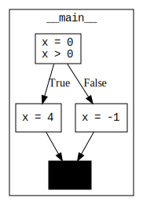

# Control Flow Graphs

This page describes an additional PythonTA feature: visualizing the control flow of a program.
This feature makes it easier to visualize how the computer executes your program by producing a scalable control flow graph using the [graphviz] library.

**WARNING:** You must have [graphviz](https://www.graphviz.org/download/) installed to use this feature.

## Code Example

```python
x = 0
if x > 0:
    x = 4
else:
    x = -1
```

The corresponding control flow graph for the code example above is included below:



## Sample Usage

This feature uses `python_ta.cfg.generate_cfg` to produce these control flow graphs.

The first argument specifies which Python file to create a control flow graph for. By default, it generates a control flow graph of the current file in which it is called from.

```python
# my_file.py

... # code here

if __name__ == "__main__":
    import python_ta.cfg

    python_ta.cfg.generate_cfg()
```

After running this file, a new svg file is created called `my_file.svg`.

This feature is not limited to just the Python file from which the function is called. It can also be used to generate a control flow graph of a different Python file. The set-up is the exact same as before, except we can pass an argument to the function call which is the path to the target Python file.

```python
import python_ta.cfg

python_ta.cfg.generate_cfg("my_file.py")
```

**Note:** only one control flow graph can be generated per function call (i.e. you can't pass in a list of files to generate control flow graphs for).

## API

```{eval-rst}
.. autofunction:: python_ta.cfg.generate_cfg
```

[graphviz]: https://www.graphviz.org/
